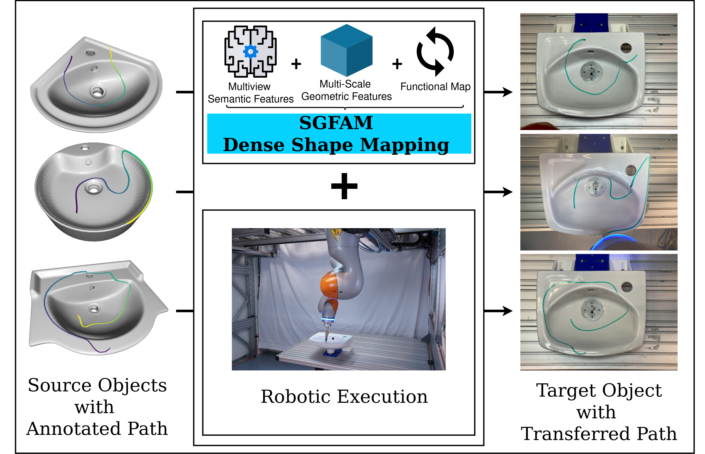
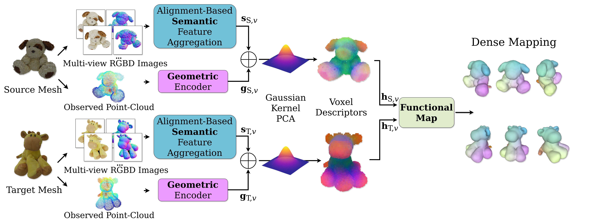

# SGFAM: Semantic and Geometric Features Aggregation for Dense Shape Matching in Generalizable Robotic Manipulation

[](https://ieeexplore.ieee.org/abstract/document/11488498)
[](https://www.python.org/)
[](https://www.docker.com/)
[](LICENSE)

Official repository to reproduce the method and experiments from the IEEE Robotics and Automation Letters (RA-L 2026) paper:  
[**"SGFAM: Semantic and Geometric Features Aggregation for Dense Shape Matching in Generalizable Robotic Manipulation"**](https://ieeexplore.ieee.org/abstract/document/11488498)  
*Paolo Sebeto, Christian Hartl-Nesic, Jean-Baptiste Weibel, Daniel Zimmer, Andreas Holzinger, and Markus Vincze.*

---



---

## 📌 Overview

Automating continuous surface processing tasks—such as industrial polishing, painting, drawing, or household cleaning—requires robots to adapt manipulation paths across novel object instances with diverse shapes and appearances. 

**SGFAM** is a zero-shot pipeline that achieves robust, topology-aware dense shape correspondence without network retraining or category-specific fine-tuning. Key innovations include:

1. **Alignment-Based Multi-View Aggregation**: Prioritizes semantic features extracted from Vision Foundation Models (VFMs such as DINOv2 or DIFT) based on surface normal alignment with camera optical axes, filtering out view-dependent noise.
2. **Multi-Resolution Geometric Features**: Augments high-level semantic context with local spatial precision using deep multi-resolution geometric encoders (FCGF, GeDi) or handcrafted descriptors (FPFH).
3. **Non-Linear Descriptor Fusion via Kernel PCA (KPCA)**: Unfolds the complex non-linear feature space resulting from concatenating semantic and geometric descriptors using Gaussian RBF Kernel PCA.
4. **Spectral Functional Map Inference & Path Transfer**: Solves for a compact functional map matrix to recover a dense point-to-point correspondence matrix, enabling direct transfer of continuous surface paths for robotic execution.



---

## 📁 Repository Structure

```
SGFAM/
├── assets/                       # Flowchart and teaser images for documentation
├── configs/                      # Predefined camera setup and rendering configs
├── descriptors_precomp/          # Descriptor extraction module
│   └── precompute_descriptors.py # Script for multi-view VFM & geometric feature extraction
├── functional_maps/              # Spectral functional map solvers and regularizations
├── geom_descriptors_servers/     # Docker containers serving FCGF & GeDi descriptors
│   ├── Dockerfile                # Multi-stage GPU build for FCGF (WarpConvNet) & GeDi
│   ├── docker-compose.yml        # Docker Compose configuration for microservices
│   ├── fcgf_server.py            # FCGF WarpConvNet REST server (Port 8000)
│   └── gedi_server.py            # GeDi REST server (Port 5000)
├── rendering/                    # BlenderProc / synthetic rendering utilities
│   ├── generate_poses.py        # Generate icosphere camera sampling poses
│   └── render_mesh_templates.py # Render multi-view RGBD, normals & masks
├── utils/                        # Core modular library
│   ├── mesh_loader.py            # Watertight decimation, UV texture extraction & voxel search
│   ├── functional_map.py         # KPCA feature reduction & LBO functional map solver
│   ├── path_transfer.py          # Geodesic curve tracing & B-Spline interpolation
│   ├── trajectory_exporter.py    # LRF computation (Procrustes) & robot trajectory export
│   └── kpca_torch.py             # GPU PyTorch Kernel PCA implementation
└── sgfam_inference.py           # Main CLI entrypoint for SGFAM inference & path transfer
```

---

## 🛠️ Installation & Setup

### 1. Environment Setup

Clone the repository and install the dependencies from `requirements.txt` into your preferred Python environment (e.g., `venv`, `conda`, or `pipenv`):

```bash
git clone https://github.com/paulie17/SGFAM.git
cd SGFAM

# Create and activate a virtual environment (e.g., venv)
python -m venv .venv
source .venv/bin/activate

# Install dependencies
pip install -r requirements.txt
```

### 2. Geometric Descriptors Microservices (Docker)

To compute deep geometric features (**FCGF** with WarpConvNet backend or **GeDi**), launch the descriptor microservices via Docker Compose.

> **Tip**: Launch the containers in detached mode (`-d`) so you can run rendering, precomputation, and inference scripts in the same terminal session:

```bash
cd geom_descriptors_servers

# Build and start all geometric descriptor servers in detached mode
docker compose up -d

# Or start specific servers individually:
# docker compose up -d fcgf_server
# docker compose up -d gedi_server

cd ..
```

* **FCGF Server**: Listens on `http://localhost:8000/compute_fcgf_features`
* **GeDi Server**: Listens on `http://localhost:5000/compute_gedi_descriptors`

---

## 🚀 Step-by-Step Workflow

### Step 1: Generate Camera Poses & Render Multi-View Meshes (BlenderProc)

First, generate the icosphere camera sampling poses (saved to `predefined_poses/`):

```bash
# Generate icosphere camera sampling poses
blenderproc run rendering/generate_poses.py
```

Then, render multi-view RGB-D images, object masks, camera poses, and surface normals of textured 3D models using `BlenderProc`:

```bash
# Render mesh templates defined in the configuration file
blenderproc run rendering/render_mesh_templates.py configs/rendering_templates_cfg.yaml
```

### Step 2: Launch Geometric Descriptor Servers

Ensure the FCGF and GeDi Docker services are running in detached mode:

```bash
docker compose -f geom_descriptors_servers/docker-compose.yml up -d
```

### Step 3: Precompute Semantic & Geometric Voxel Descriptors

Extract DINOv2 / DIFT semantic features and FCGF / GeDi / FPFH geometric features across the rendered views:

```bash
# Example: Extract DINOv2 semantic features and FCGF geometric features
python descriptors_precomp/precompute_descriptors.py \
    --templates-path path/to/rendered_object_directory/ \
    --semantic-desc dino \
    --geometric-desc fcgf \
    --aggregation alignment \
    --save \
    --rotate
```

### Step 4: Dense Matching & Path Transfer Inference

Run the main SGFAM inference script to fuse descriptors via KPCA, compute the functional map, visualize dense correspondences, and transfer continuous paths between source and target models:

```bash
python sgfam_inference.py \
    --input-1 path/to/source_descriptors_dino_fcgf.npz \
    --input-2 path/to/target_descriptors_dino_fcgf.npz \
    --reduce-dim \
    --pca-type kernel \
    --target-dim 128 \
    --n-ev 50 \
    --input-traj-path path/to/source_trajectory.txt \
    --save-target-traj \
    --animation
```

### Key CLI Options for `sgfam_inference.py`

| Flag | Description | Default |
| :--- | :--- | :--- |
| `--input-1` | Path to the source `.npz` descriptor file | **Required** |
| `--input-2` | Path to the target `.npz` descriptor file | **Required** |
| `--reduce-dim` | Flag to enable descriptor dimensionality reduction via PCA/KPCA | `False` |
| `--pca-type` | PCA method: `kernel` (Kernel PCA) or `linear` | `kernel` |
| `--target-dim` | Target feature dimension after PCA/KPCA reduction | `128` |
| `--n-ev` | Number of Laplace-Beltrami Operator (LBO) eigenfunctions | `50` |
| `--simplify` | Simplify mesh using watertight decimation | `False` |
| `--only-sem` | Use only semantic descriptors for shape matching | `False` |
| `--only-geom` | Use only geometric descriptors for shape matching | `False` |
| `--input-traj_path` | Path to source 3D trajectory text file to transfer | `None` |
| `--save-target_traj` | Save transferred trajectory text file for target mesh | `False` |
| `--save-input_traj` | Save source input trajectory text file | `False` |
| `--scale-input_traj` | Scale factor for input trajectory points | `1.0` |
| `--scale` | Units for trajectory output (`m` or `mm`) | `m` |
| `--animation` | Interactively animate target path LRF coordinate frames | `False` |
| `--load-colors` | Extract vertex colors from UV texture maps | `False` |
| `--save-emb-meshes` | Save PLY meshes colored with functional map embeddings | `False` |
| `--output-directory` | Directory path to save output trajectory and mapping results | `""` |

---

## 🤖 Robotic Trajectory Export

Transferred continuous paths are automatically:
1. Interpolated using B-Splines for smooth robot motion.
2. Projected onto the un-simplified, original target mesh surface using Signed Distance Fields (SDF).
3. Fitted with Local Reference Frames (LRF) using tangent, normal, and Procrustes-aligned binormal axes.
4. Exported into pose text files containing positions ($X, Y, Z$) and ZYX Euler orientation angles for robot controller execution (e.g. KUKA iiwa).

---

## 🙏 Acknowledgements & Codebase Credits

This repository incorporates components and builds upon foundational code and models from the following open-source projects:

* **[DIFT](https://github.com/Tsingularity/dift)**: Diffusion Features for Emergent Feature Extraction.
* **[DenseMatcher](https://github.com/TEA-Lab/DenseMatcher/tree/master)**: Functional maps framework and regularization terms for dense correspondence.
* **[FCGF](https://github.com/chrischoy/FCGF)**: Fully Convolutional Geometric Features (WarpConvNet backend).
* **[GeDi](https://github.com/fabiopoiesi/gedi)**: General Deep Local Descriptors for 3D point clouds.
* **[BlenderProc](https://github.com/DLR-RM/BlenderProc)**: Procedural Blender pipeline for realistic multi-view synthetic rendering.

---

## 📚 Citation

If you find SGFAM useful for your research or robotic applications, please cite our paper:

```bibtex
@article{sebeto2026sgfam,
  title={SGFAM: Semantic and Geometric Features Aggregation for Dense Shape Matching in Generalizable Robotic Manipulation},
  author={Sebeto, Paolo and Hartl-Nesic, Christian and Weibel, Jean-Baptiste and Zimmer, Daniel and Holzinger, Andreas and Vincze, Markus},
  journal={IEEE Robotics and Automation Letters},
  year={2026},
  publisher={IEEE}
}
```

---

## 📄 License

This project is licensed under the MIT License - see the [LICENSE](LICENSE) file for details.

